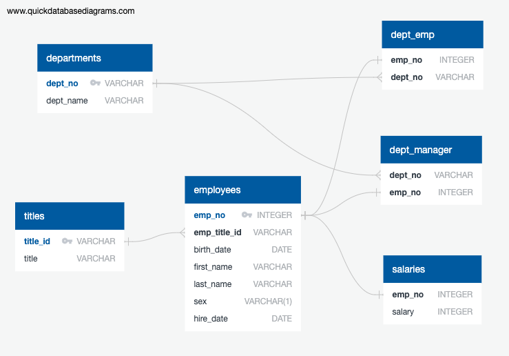

# Employee Database: A Mystery in Two Parts

## Background

Your first major task is a research project on employees of the corporation from the 1980s and 1990s. All that remain of the database of employees from that period are six CSV files.

Design the tables to hold data in the CSVs, import the CSVs into a SQL database, and answer questions about the data. In other words, perform:

1. Data Engineering

3. Data Analysis


## Instructions

#### Data Modeling

Inspect the CSVs and sketch out an ERD of the tables. 

#### Data Engineering

* Use the information you have to create a table schema for each of the six CSV files. Remember to specify data types, primary keys, foreign keys, and other constraints. Be sure to create tables in the correct order to handle foreign keys.



* Import each CSV file into the corresponding SQL table. 

#### Data Analysis

Use SQL to explore:

1. List the following details of each employee: employee number, last name, first name, sex, and salary.

2. List first name, last name, and hire date for employees who were hired in 1986.

3. List the manager of each department with the following information: department number, department name, the manager's employee number, last name, first name.

4. List the department of each employee with the following information: employee number, last name, first name, and department name.

5. List first name, last name, and sex for employees whose first name is "Hercules" and last names begin with "B."

6. List all employees in the Sales department, including their employee number, last name, first name, and department name.

7. List all employees in the Sales and Development departments, including their employee number, last name, first name, and department name.

8. In descending order, list the frequency count of employee last names, i.e., how many employees share each last name.

## Bonus


1. Import the SQL database into Pandas. By doing the following:
   ```sql
   from sqlalchemy import create_engine
   engine = create_engine('postgresql://localhost:5432/<your_db_name>')
   connection = engine.connect()
   ```

2. Create a histogram to visualize the most common salary ranges for employees.

3. Create a bar chart of average salary by title.

4. Discover on avgerage salary ranges for employees¶
* Average for all positions have no significant difference, all of them are between 48,000 to 58,000.
* But the most common range of salaries shows that the most common range is 40,000 to 50,000, this means the range of salary for each title is varies.


